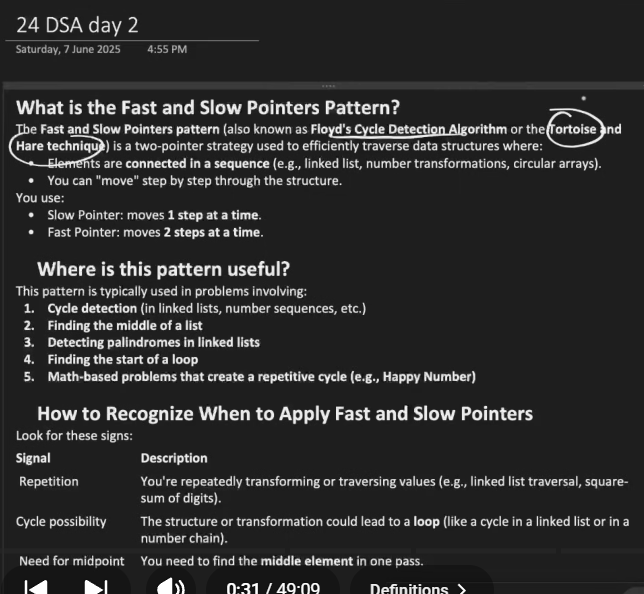
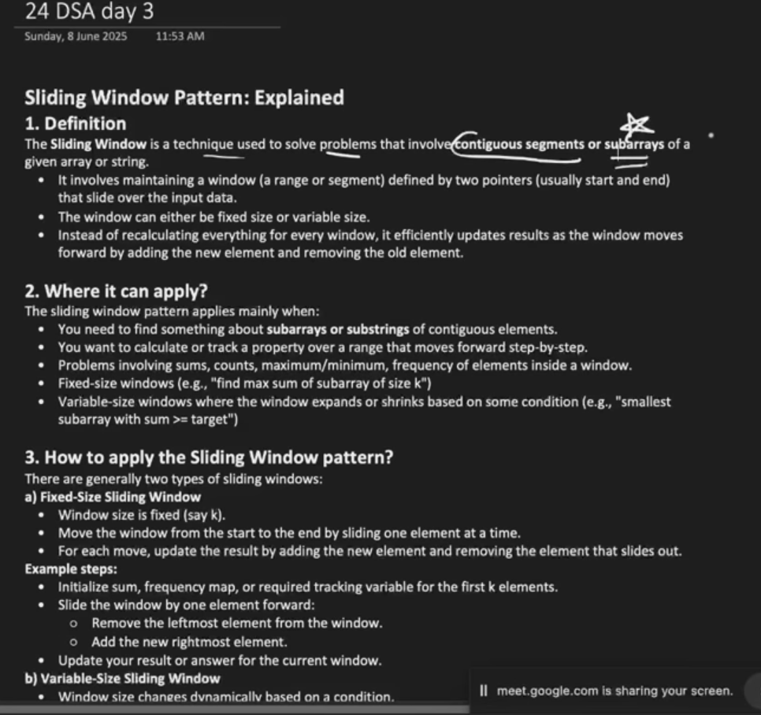
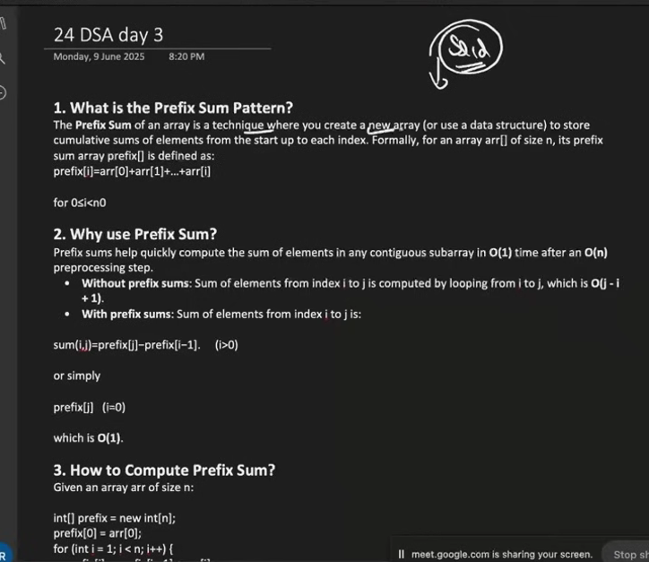
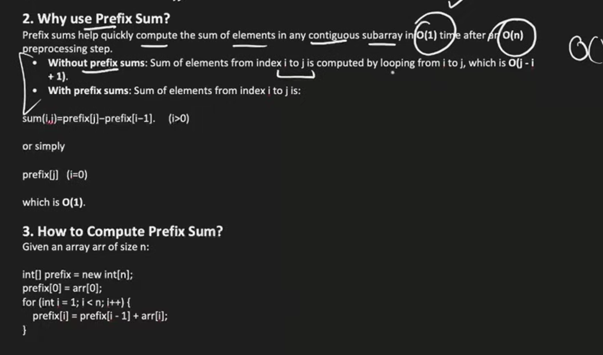

# what is two pointer

    

    the two pointer techniques involves using two indices to iterate over a data structure (usually array or a string ) to solve problems effiecintly n avoiding nested loops

# two pointer technices

**fast and slow pointer patterns**

## Sliding Window

    

## prefix sum

    
    
